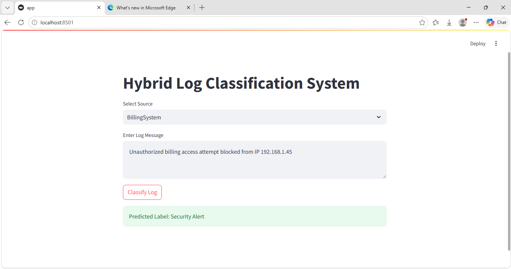

# Hybrid Log Classification System

A Hybrid NLP-based Log Classification System built using Regex, Sentence Transformers, Logistic Regression, and LLMs.

This project classifies enterprise log messages into categories like:
- Error
- Warning
- Security Alert
- Success

---

## Features

- Regex-based classification
- BERT/Sentence Transformer classification
- LLM-based classification
- Streamlit web interface
- Real-time log prediction
- CSV log classification support

---

## Tech Stack

- Python
- Streamlit
- Scikit-learn
- Sentence Transformers
- FastAPI
- Pandas

## Future Improvements

- Confidence score prediction
- Batch CSV upload
- Analytics dashboard
- Better model accuracy
- Cloud deployment

---
## Screenshot

## Disclaimer

This project is inspired by educational implementations from Codebasics and was extended with Streamlit integration and UI customization for learning purposes.

---

